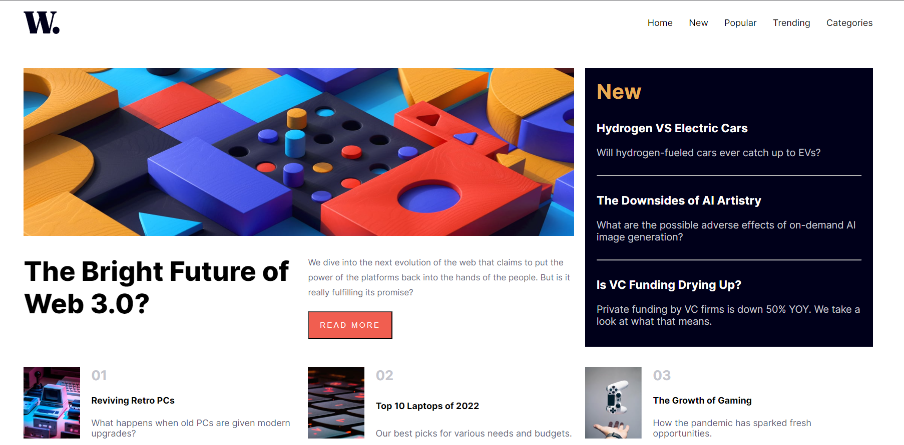

# Frontend Mentor - News homepage solution

This is a solution to the [News homepage challenge on Frontend Mentor](https://www.frontendmentor.io/challenges/news-homepage-H6SWTa1MFl). Frontend Mentor challenges help you improve your coding skills by building realistic projects. 

## Table of contents

- [Overview](#overview)
  - [The challenge](#the-challenge)
  - [Screenshot](#screenshot)
  - [Links](#links)
- [My process](#my-process)
  - [Built with](#built-with)
  - [What I learned](#what-i-learned)
  - [Continued development](#continued-development)
- [Author](#author)

**Note: Delete this note and update the table of contents based on what sections you keep.**

## Overview

### The challenge

Users should be able to:

- View the optimal layout for the interface depending on their device's screen size
- See hover and focus states for all interactive elements on the page

### Screenshot



### Links

- Solution URL: [https://www.frontendmentor.io/solutions/news-home-page-using-html-css-grid-css-flexbox-and-js-R2HkP1PPXg](https://www.frontendmentor.io/solutions/news-home-page-using-html-css-grid-css-flexbox-and-js-R2HkP1PPXg)
- Live Site URL: [https://news-homepage-six-kappa.vercel.app/](https://news-homepage-six-kappa.vercel.app/)

## My process

### Built with

- Semantic HTML5 markup
- CSS custom properties
- Flexbox
- CSS Grid
- Mobile-first workflow

### What I learned

I have become familiar with CSS grid layout. I learned to use grid template areas to dictate how many rows and columns there will be, as well as where each section of the page will go. 

```css
    .container {
        grid-template-rows: auto auto auto;
        grid-template-columns: auto auto auto;
        grid-template-areas: 
        'main-img main-img new'
        'main-heading main-desc new'
        'one two three';
        column-gap: 20px;
    }
```

Above is my css for the desktop view. I used media queries to change the grid layout accordingly.

```js
// Open menu on button click
open_menu_btn.addEventListener("click", function() {
    popup.style.display = "block";
    body.classList.add("background-dim");
})

// Close menu on button click
close_menu_btn.addEventListener("click", function() {
    popup.style.display = "none";
    body.classList.remove("background-dim");
})
```

I made use of a class that would dim the background by changing its alpha value whenever the mobile menu was opened.

### Continued development

I intend to make become more savy with grid layout, and continue to utilize it along with flexbox.


## Author

- LinkedIn - [Adrian Guerra](https://www.linkedin.com/in/adrian-guerra-a210a4196/)
- Frontend Mentor - [@adie9](https://www.frontendmentor.io/profile/adie9)

